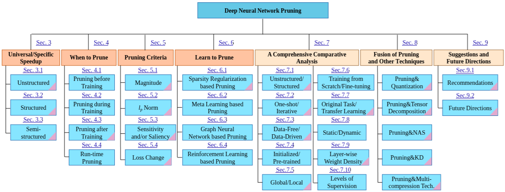

# PyTorch-Pruning

## Motivation

Even though there are awesome researches (i.e., Awesome-Pruning; [GitHub](https://github.com/he-y/Awesome-Pruning), [GitHub](https://github.com/hrcheng1066/awesome-pruning)) focused on pruning and sparsity, there are no (maybe... let me know if there are) open-source for fair and comprehensive benchmarks, making first-time users confused. And this made a question, "What is SOTA in the fair environment? More deeply, how can we profile them?"

## Why can PyTorch-Pruning be a fair benchmark?

Therefore, [PyTorch-Pruning](http://github.com/namgyu-youn/PyTorch-Pruning) mainly focuses on implementing/applying a variable of pruning research, benchmarking, and profiling in a fair baseline.

For example, in the LLaMA benchmarks, we use three evaluation metrics and prompts inspired by Wanda (Sun et al., 2023) and SparseGPT (ICML'23) :

* Model (parameters) size
* Latency : Time TO First Token (TTFT) and Time Per Output Token (TPOT)
* Perplexity (PPL) scores : We compute it in same way like [Wanda and SparseGPT](https://github.com/locuslab/wanda/blob/8e8fc87b4a2f9955baa7e76e64d5fce7fa8724a6/lib/prune.py#L214)
* Input Prompt : We uses `databricks-dolly-15k` like Wanda, SparseGPT

## Contribution Guide

Our main objective (2025-Q3 Roadmap) can be checked at [here](https://github.com/namgyu-youn/PyTorch-Pruning/issues/1). If you have any ideas, feel free to comment, open issue. Every PR should be directly linked to `main` branch.


> Since our goal is applying more researches for pruning (sparsity), we are not planning to apply inference engines like ONNX, TensorRT, vLLM, or TorchAO. But applying those engines is definitely a long-term objective, and always welcome!

## User Guide

This projects recommend `uv` for pypi (python packaging index).

```bash
# Setup virtual environment
uv .venv
source .venv/bin/activate
uv pip install ".[dev]"

# Run any scripts for pruning
uv run experiments/pytorch_pruning.py
```

## References



[[1](https://hanlab.mit.edu/courses/2024-fall-65940)] TinyML and Efficient Deep Learning Computing (MIT-6.5940)

[[2](https://arxiv.org/abs/2308.06767)] A Survey on Deep Neural Network Pruning: Taxonomy, Comparison, Analysis, and Recommendations (IEEE'24)

[3] Pruning Deep Neural Networks from a Sparsity Perspective (ICLR'23, [arXiv](https://arxiv.org/abs/2302.05601))

[[4](https://icml.cc/virtual/2024/oral/35453)] APT: Adaptive Pruning and Tuning Pretrained LLM for Efficient Training and Inference (ICML'24)

[[5](https://arxiv.org/abs/2312.11983)] Fluctuation-based Adaptive Structured Pruning for Large Language Models (AAAI'24)

[[6](https://arxiv.org/abs/2407.04616)] Isomorphic Pruning for Vision Models (ECCV'24)

[[7]((https://arxiv.org/abs/2111.13445))] How Well Do Sparse ImageNet Models Transfer? (CVPR'22)

[[8](https://arxiv.org/abs/2306.11695)] A Simple and Effective Pruning Approach for Large Language Models (ICLR'24)

[[9](https://blog.squeezebits.com/how-to-quantize-transformerbased-model-for-tensorrt-deployment-55802)] How to Quantize Transformer-based model for TensorRT Deployment)

[[10](https://arxiv.org/abs/2302.02596)] Ten Lessons We Have Learned in the New "Sparseland": A Short Handbook for Sparse Neural Network Researchers (ICLR'25)

[[11](https://arxiv.org/abs/2301.12900)] Depgraph: Towards any structural pruning (CVPR'23)

[[12](https://paperswithcode.com/task/network-pruning)] Papers with Code : Pruning Benchmark

[[13](https://github.com/VITA-Group/SMC-Bench)] Sparsity May Cry Benchmark (SMC-Bench, ICLR'23)