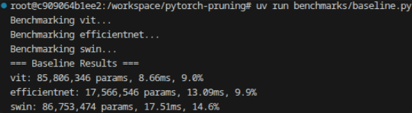

# Benchmarks

Benchmarks aims to compare Pruning After Training (PAT) benchmarks.

- Metrics : Model (parameter) size, latency, and accuracy
- Resources : NVIDIA RTX A2000
- Baseline models (timm) : ViT, EfficientNet, Swin-T


## Original Benchmarks


```bash
vit: 85,806,346 params, 8.66ms, 9.0%
efficientnet: 17,566,546 params, 13.09ms, 9.9%
swin: 86,753,474 params, 17.51ms, 14.6%
```



Note: Since `timm` models are pre-trained from ImageNet dataset, accuracy is quiet low.